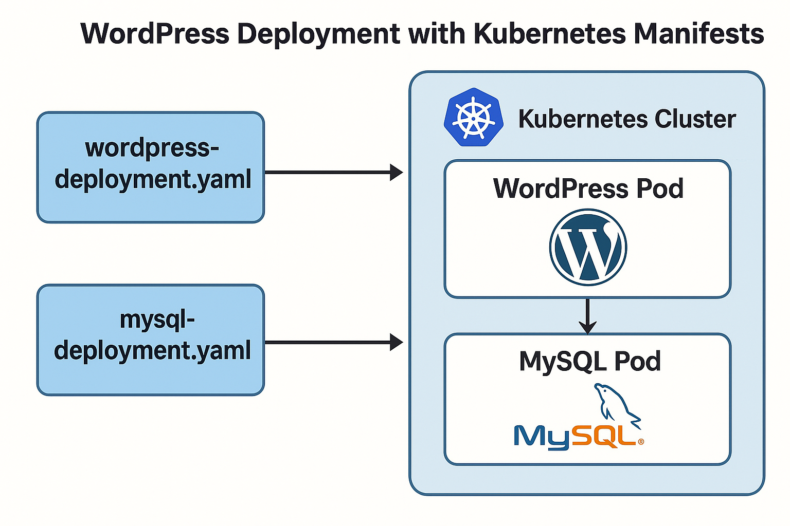

# 🚀 Kubernetes Project

Déploiement complet d'un site WordPress sur un cluster Kubernetes avec persistance des données, configuration sécurisée via secrets, et exposition publique via un service NodePort.



## 📁 Structure du projet

```
.
├── manifest
│   ├── mysql
│   │   ├── deployment.yml          # Déploiement de la base de données MySQL
│   │   ├── pvc.yml                 # Claim de volume pour MySQL
│   │   ├── pv.yml                  # Volume statique pour MySQL
│   │   ├── secret.yml              # Secret encodé en base64 pour sécuriser les accès
│   │   └── service.yml             # Service ClusterIP pour MySQL
│   ├── wordpress
│   │   ├── deployment.yml          # Déploiement du frontend WordPress
│   │   ├── secret.yml              # Secret encodé en base64 pour sécuriser les accès
│   │   └── service.yml             # Service NodePort pour exposer WordPress
│   └── wordpress-namespace.yml
└── README.md
```

---

## 🧱 Stack technique

- Kubernetes (manifests YAML)
- WordPress (dernier tag officiel)
- MySQL 5.7
- Secrets Kubernetes
- Persistent Volumes / Persistent Volume Claims
- NodePort pour l'exposition de WordPress

---

## 📦 Prérequis

- Un cluster Kubernetes fonctionnel (ex: Minikube, kind, k3s ou cluster cloud)
- `kubectl` installé et configuré
- Namespace `wordpress` créé :
  ```bash
  kubectl create namespace wordpress
  ```

---

## 🚀 Déploiement

> Applique les manifestes dans cet ordre :

```bash
kubectl apply -f mysql/secret.yml
kubectl apply -f mysql/pv.yml
kubectl apply -f mysql/pvc.yml
kubectl apply -f mysql/service.yml
kubectl apply -f mysql/deployment.yml

kubectl apply -f wordpress/secret.yml
kubectl apply -f wordpress/service.yml
kubectl apply -f wordpress-deployment.yml
```

---

## 🌐 Accès à WordPress

Une fois le déploiement terminé, récupérez le NodePort de WordPress :

```bash
kubectl get svc -n wordpress
```

Accédez à l’interface via :  
**http://<IP-du-node>:<PORT>**

Si vous utilisez Minikube :

```bash
minikube service wordpress-service -n wordpress
```

---

## ✅ Fonctionnalités

- 🔐 Sécurisation des mots de passe et données via `Secrets`
- 💾 Persistance des données MySQL avec `PV` / `PVC`
- 🔌 Communication via `ClusterIP` interne entre services
- 🌍 Accès public à WordPress via `NodePort`

---

## 🛠️ Prochaines améliorations (To-Do)

- [ ] Ajouter un Ingress Controller (ex: Traefik ou NGINX)
- [ ] Support de HTTPS (Let’s Encrypt avec cert-manager)
- [ ] Surveillance (Prometheus / Grafana)
- [ ] Déploiement CI/CD via GitHub Actions

---

## 👨‍💻 Auteur

**[Hrubech HOMBESSA]**  
💼 DevOps Engineer / Full Stack Developer  
🔗 [github.com/Hrubech](https://github.com/Hrubech)

---

## 📄 Licence

Ce projet est sous licence MIT.  
Libre à vous de le modifier et l’utiliser dans vos projets personnels ou professionnels !